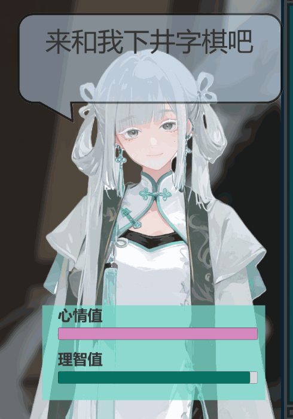

# JZQ Demo 项目

## 克隆源码注意事项

本项目中的美术素材文件较大，因此使用了 Git Large File Storage (LFS) 进行管理。在克隆本项目之前，请确保您已安装 Git LFS。

**步骤：**

1.  **安装 Git LFS**：
    如果您尚未安装 Git LFS，请访问 [Git LFS 官方网站](https://git-lfs.github.com/) 下载并安装。
    通常，在安装完成后，您需要执行一次 `git lfs install` 来初始化 Git LFS。

2.  **克隆项目**：
    使用常规的 `git clone` 命令克隆本仓库：
    ```bash
    git clone https://github.com/Donmmn/Tic-tac-toe.git
    ```

3.  **拉取 LFS 文件**：
    克隆完成后，项目中的大文件（如美术素材）可能仅为指针文件。您需要执行以下命令来下载这些文件的实际内容：
    ```bash
    cd Tic-tac-toe
    git lfs pull
    ```

完成以上步骤后，您的本地仓库将包含所有必要的文件。

## 素材来源说明

*   游戏中的角色 **今汐 (Jinxi)** 的形象来自于游戏《鸣潮》。
*   本项目中的大部分其他美术素材（除角色IP、音乐、背景外）为 AI 生成。
*   游戏的音乐与背景素材来源于公开的 Galgame 素材站或其他游戏。

## 游戏概览与核心玩法

**核心游玩演示：**


### 游戏玩法
这是一款人机交互的井字棋（Tic-Tac-Toe）对战游戏。

**基础规则：**

*   游戏在一个 3x3 的九宫格棋盘上进行。
*   玩家与 AI 轮流在空白的格子中放置自己的标记（例如 "X" 或 "O"）。
*   **固定玩家先手**。
*   率先在横向、纵向或斜向任意一条线上成功连成三个己方标记的一方获胜。
*   如果棋盘被下满，但双方均未达成胜利条件，则为平局。

**计分与最终胜利：**

*   每一局井字棋的胜利会为获胜方记1分。
*   首先累计获得 **5分** 的一方将赢得最终的对战胜利。

**与"今汐"的交互及收集系统：**

与您对战的虚拟角色名为 **今汐 (Jinxi)**。今汐拥有以下特殊属性，这些属性会受到每局对战结果的影响：

*   **心情值 (Mood Value)**：今汐的心情会根据对局的胜负情况、以及过程中的某些特定条件而波动。心情值的高低将直接影响最终对战结束后所触发的 **结局**。游戏内共设计了 **12个不同的结局** 等待玩家解锁。
*   **理智值 (Sanity Value)**：今汐的理智值同样会受到对局情况的影响。理智值的高低会影响其在下棋时的 **AI表现**，具体来说，较低的理智值可能会导致AI出现更多的失误。

此外，在对弈过程中，玩家还可以通过触摸与今汐进行互动（例如摸摸她的头）。这些互动会影响今汐的心情值，并且每个触摸区域有1分钟的冷却时间。游戏共设有2个这样的触摸互动区域。

**头部互动演示：**


### 游戏教程概览


### 结局查看与设置
*   **查看回忆**：玩家可以在游戏内的"查看回忆"界面回顾所有已经解锁的结局剧情。
    
*   **设置选项**：
    *   **提前解锁所有回忆**：如果希望立即体验所有结局，可以在设置界面的解锁码输入框中输入"123456"。
    *   **管理游戏数据**：在设置界面，玩家可以选择：
        *   **清空结局进度**：清除所有已解锁的结局记录，方便重新收集。
        *   **恢复初始教程**：如果您跳过了游戏的初始教程，或者希望重新查看引导，可以在此恢复。

## 开发工具与编辑器展示

本项目使用了一系列自定义编辑器工具来辅助内容的配置与管理。

**表情事件编辑器：**


**结局编辑器：**


**教程编辑器：**
 